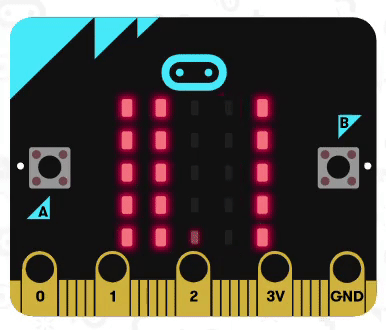

# 2桁表示

micro:bitのLEDディスプレイに0-99の数の2桁表示を行います。0-9.9の間は小数点が表示されます。  
16進2桁の整数の表示を行うこともできます。

## 使い方

``||~ を2桁で表示する||`` は10進数で0.0-99を表示します。

``||~ を16進2桁で表示する||`` は16進数で0-255(FF)を表示します。

## 元ネタ
[tsjmt](https://twitter.com/tsjmt)さんの[ツイート](https://twitter.com/tsjmt/status/1383378812574961668)

## サポート

* for PXT/microbit

## ライセンス

MIT
